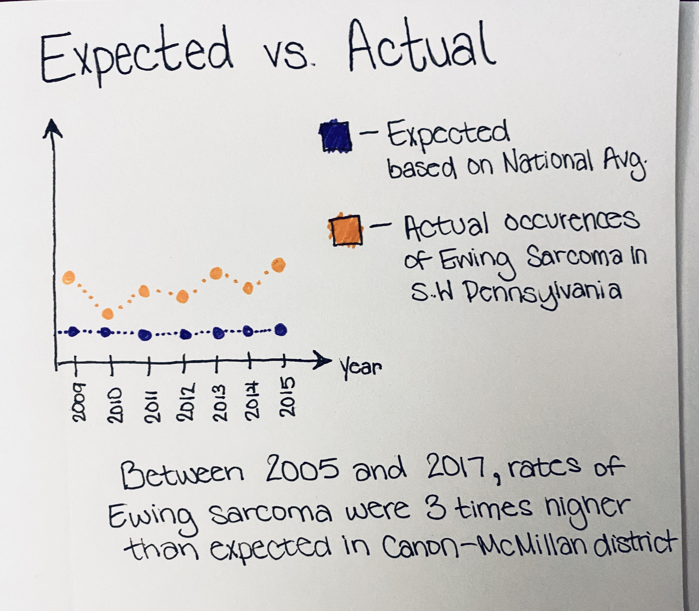
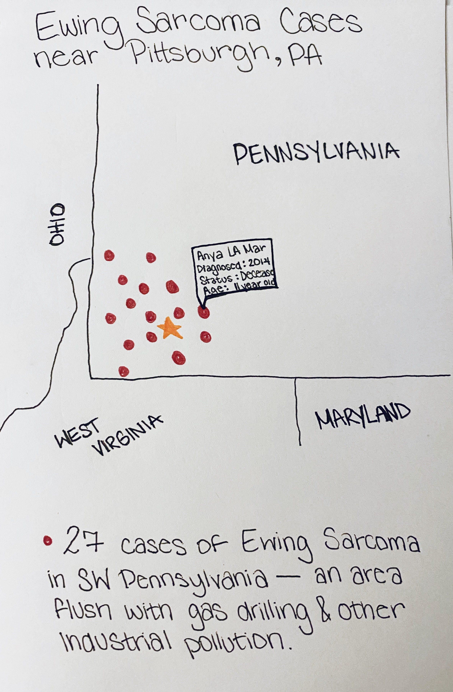
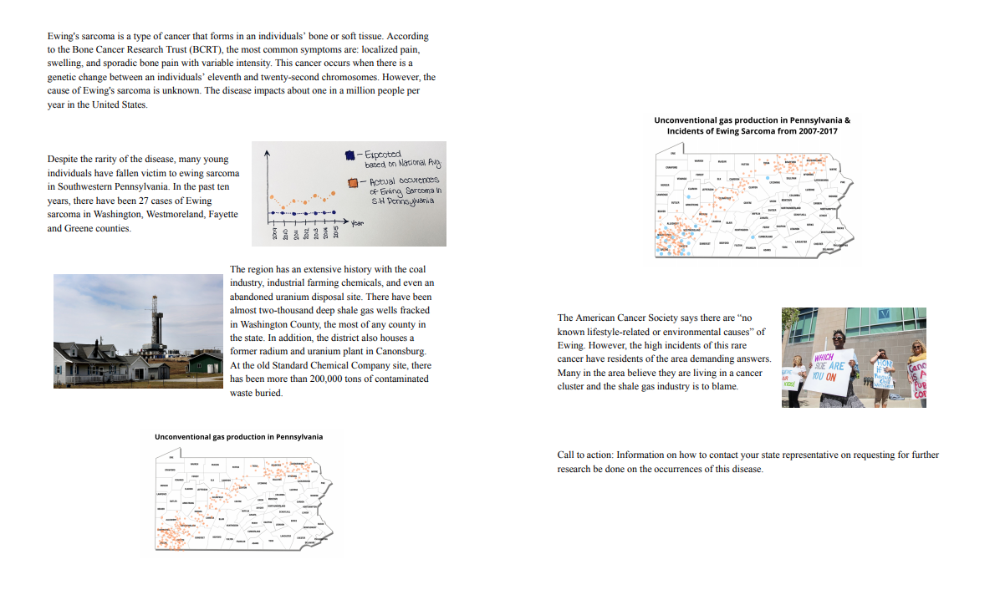
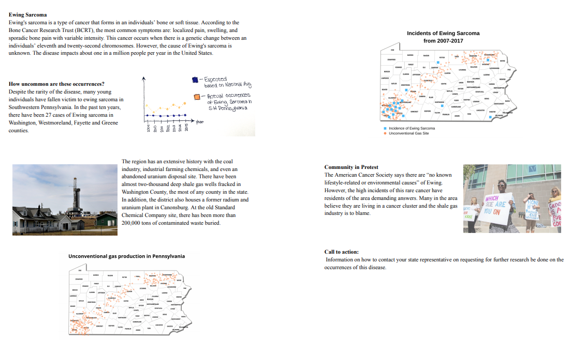

[Back Home](/readme.md)
 
# Final Project 

# The Idea
## Project Outline  

I. Introduction of Fracking Boom in Pennsylvania 

II. Focusing on Fracking in Southwestern PA

III. Health Impact of Fracking

IV. Ewing Sarcoma Cases 

V. Current Study and What Needs to be Done 

IV. Call to Action 

## Summary 
Ewing's sarcoma is a type of cancer that forms in an individuals’ bone or soft tissue. According to the Bone Cancer Research Trust (BCRT), the most common symptoms are: localized pain, swelling, and sporadic bone pain with variable intensity. This cancer occurs when there is a genetic change between an individuals’ eleventh and twenty-second chromosomes. However, the cause of Ewing's sarcoma is unknown. The disease impacts about one in a million people per year in the United States.
Despite the rarity of the disease, many young individuals have fallen victim to ewing sarcoma in Southwestern Pennsylvania. In the past ten years, there have been 27 cases of Ewing sarcoma in Washington, Westmoreland, Fayette and Greene counties.
The region has an extensive history with the coal industry, industrial farming chemicals, and even an abandoned uranium disposal site. There have been almost two-thousand deep shale gas wells fracked in Washington County, the most of any county in the state. In addition, the district also houses a former radium and uranium plant in Canonsburg. At the old Standard Chemical Company site, there has been more than 200,000 tons of contaminated waste buried.
The American Cancer Society says there are “no known lifestyle-related or environmental causes” of Ewing. However, the high incidents of this rare cancer have residents of the area demanding answers. Many in the area believe they are living in a cancer cluster and the shale gas industry is to blame.

## Project Structure
 The structure of my project will focus on two main sources of data. The project will begin with an explanation on fracking in Pennsylvania. Then I will use State Cancer data to illustrate the prevalence of cancer in the state. I want to make sure that I am simply presenting facts in my project and allowing the reader to make any connections. There is no proven environmental link to Ewing Sarcoma and I do not want my readers to come away with a wrong impression. My call to action is simply that more reasearch needs to be done to understand the impact that fracking is having on the health of PA residents. 

## Data Sources
 [Oil and Gas sites in Pennsylvania](/finalpart2.md)
 
 [Pennsylvania State Cancer Data](/finalpart2.md)
 
 Both of these data sources are critical to my project. First I will obtain information on fracking in the state on Pennsylvania through the Department of Environmental Protection. This dataset contains the latitude and longitude for all sites and the type of well that it is. 
 The Pennsylvania State Cancer Data set is a robust data set that breaksdown the occurences of cancer by county. The limitation of this dataset is that the cancer inncidents can only be broken down into 23 main cancer types. Due to this my graphs depict bone cancer generally rather than the specific form.One major limitation of my project is the lack of dataset that incapsulates the inncidents of Ewing Sarcoma specifically. 

## Method and Medium 

In order to complete my data visulalization I am using Tableau desktop. For my final project I will be using shorthand to present my work. I am choosing to work with shorthand because the platform allows you to present your narrative in an engaging design. My plan is to use tableau to create my visualization to present the data. I am choosing Tableau because much of my data will be based on geographical data and this platform allows for the creation of interactive maps.

# Design and User Research
## Sketches 

## Storyboards

## User Research 

| Interview #1       |        |
| ------------- |:-------------:| 
| What target population do you think this website was written for?| I think it’s written for a general audience to understand and prepare a call to action.  |
| What do you think the purpose of this website is?| To display the facts and ideas behind Ewing Sarcoma occurrences in PA|   
| Were any parts confusing? | The figures aren’t ordered.|    
| What changes would you make? |Make the figures numbered| 

 Interview #2       |        |
| ------------- |:-------------:| 
| What target population do you think this website was written for?| I think it’s written for researchers or policy makers in this area|
| What do you think the purpose of this website is?| To show researchers where the correlations stand with this hypothesis|   
| Were any parts confusing? | The data wasn’t clear because the pictures were obfuscated by the words|    
| What changes would you make? | Fewer words, larger pictures, legend?| 

 Interview #3       |        |
| ------------- |:-------------:| 
| What target population do you think this website was written for?|The target population is community members of these four counties |
| What do you think the purpose of this website is?| To make people cautious about their living situation |   
| Were any parts confusing? | I wasn’t sure if the dots on the map were the same or different or what they represented|    
| What changes would you make? |Making one represented in a different way other than two sets of dots.| 

Findings: 
 The target audience I am hoping to reach with my story is rather broad as it is really any residents of SouthWestern Pennsylvania who have not heard about the Ewing Sarcoma inncidents. The three indiivudals I spoke to were all residents of Southwestern PA. One indivdual has lived in Pittsburgh her entire life, and the other two moved here about two years ago. None of the individuals knew anything about subject before. My interview was based on the four questions listed above. 
 To address these issues identified I will implement the following changes to my storyboards and sketches:
   * Changing the presentation of the data points when overlaying the cancer inncidents and the gas sites to make sure it is clear. 
   * The presentation of the words and the pictures will not be as busy when it is presented in shorthand
   * The final visulalization will have proper legends and will be interactive to provide further information 
   
## Wireframes 

# Final Data Story

## The Intended Audience 
The attended audience for this is primarily for residents living in Pennsylvania. Individuals that live in this area are probably aware of the issue already, but may gain from the visualization as a supplement to this existing knowledge. From the 
user reasearch that I conducted I found out that not as many people knew about the cancer cases as I would have expected. After this research I decided that I needed to provide enough background information for individuals that had not heard anything about that story before hand. 

 Throughout the project I was able to to make various visualizations using the oil and gas sites. I was really happy about how the data visualization I made for the timelapse for the fracking sites. I wanted to convey how many more wells are in Washington County. I feel like my bubble chart that I created accomplishes this goal. With the state cancer dataset I was somewhat limited because the data did not get as specific as to the type of bone cancer. I still wanted to depict the cancer prevalence even though I did not have this breakdown. To compare the expected rate of bone cancer with what actually occured I felt the best way to show this was a simple line graph. 

 
 ## Final Story 
 [Read Me](https://carnegiemellon.shorthandstories.com/the-health-impact-of-fracking-on-southwestern-pennsylvania-
residents/index.html)

