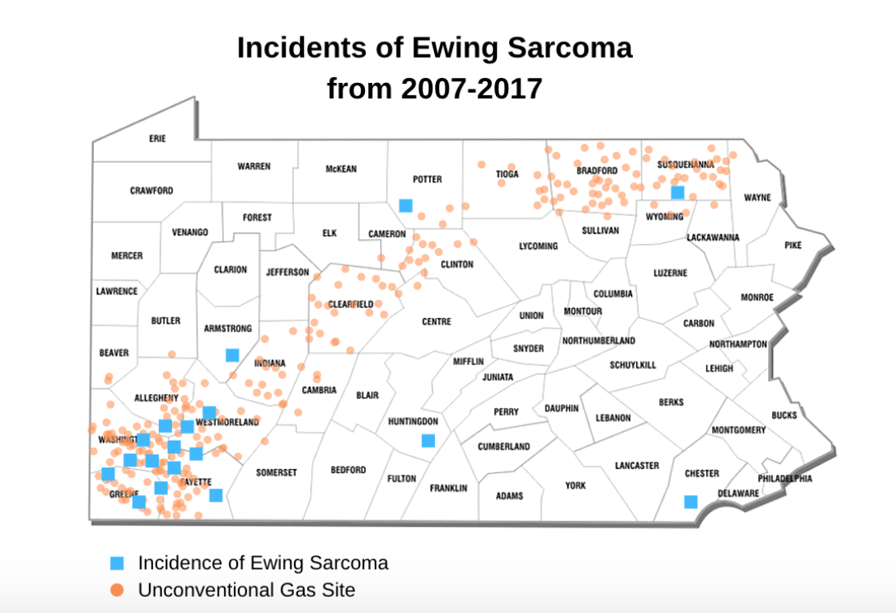

# Final Part II 

## Storyboard

## User Research 

| Interview #1       |        |
| ------------- |:-------------:| 
| What target population do you think this website was written for?| I think it’s written for a general audience to understand and prepare a call to action.  |
| What do you think the purpose of this website is?| To display the facts and ideas behind Ewing Sarcoma occurrences in PA|   
| Were any parts confusing? | The figures aren’t ordered.|    
| What changes would you make? |Make the figures numbered| 

 Interview #2       |        |
| ------------- |:-------------:| 
| What target population do you think this website was written for?| I think it’s written for researchers or policy makers in this area|
| What do you think the purpose of this website is?| To show researchers where the correlations stand with this hypothesis|   
| Were any parts confusing? | The data wasn’t clear because the pictures were obfuscated by the words|    
| What changes would you make? | Fewer words, larger pictures, legend?| 

 Interview #3       |        |
| ------------- |:-------------:| 
| What target population do you think this website was written for?|The target population is community members of these four counties |
| What do you think the purpose of this website is?| To make people cautious about their living situation |   
| Were any parts confusing? | I wasn’t sure if the dots on the map were the same or different or what they represented|    
| What changes would you make? |Making one represented in a different way other than two sets of dots.| 

Findings: 
 The target audience I am hoping to reach with my story is rather broad as it is really any residents of SouthWestern Pennsylvania who have not heard about the Ewing Sarcoma inncidents. The three indiivudals I spoke to were all residents of Southwestern PA. One indivdual has lived in Pittsburgh her entire life, and the other two moved here about two years ago. None of the individuals knew anything about subject before. My interview was based on the four questions listed above. 
 To address these issues identified I will implement the following changes to my storyboards and sketches:
   * Changing the Presentation of the data points when overlaying the cancer inncidents and the 
   * The presentation of the words and the pictures will not be as busy when it is presented in shorthand
   * The final visulalization will have proper legends and hopefully be interactive to provide further information 
   
## Revised Visualization 

